<p align="center">
  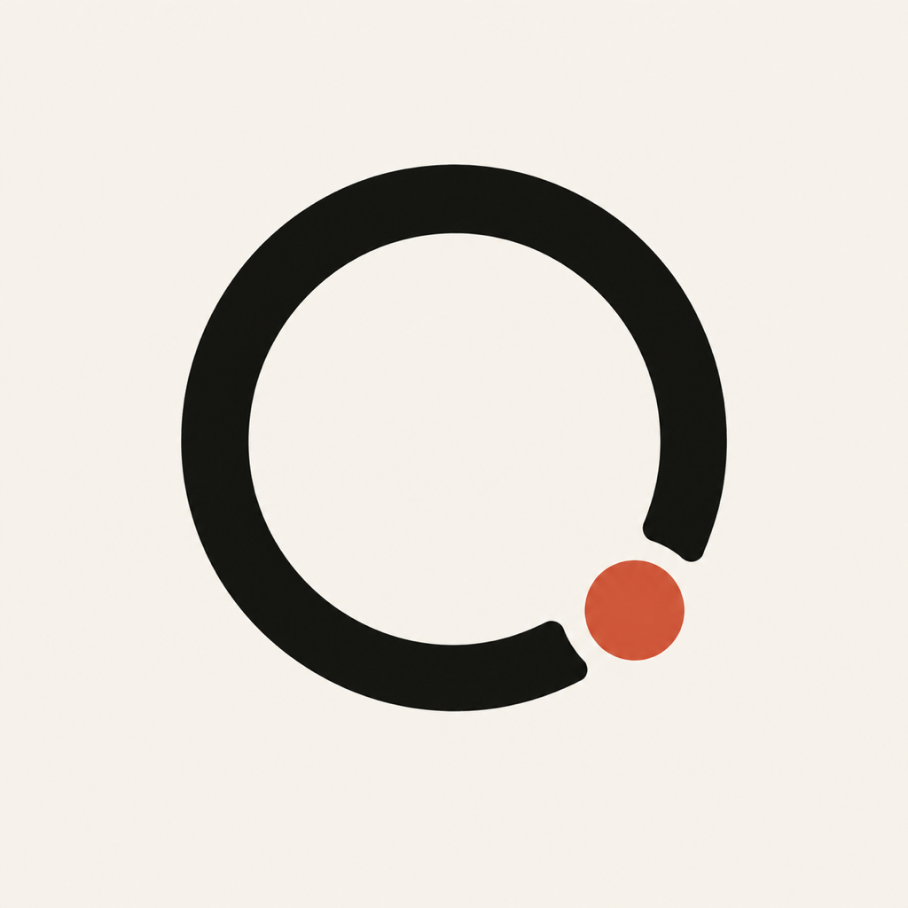
</p>

<h1 align="center">LibreRing</h1>

<p align="center"><strong>Your ring. Your data. Kept close.</strong></p>

<p align="center">
  A local-first, open-source Flutter companion for the COLMI R12 smart ring.<br />
  Calm daily views, transparent evidence, no account, and no invented health scores.
</p>

<p align="center">
  <a href="https://github.com/rubarksfield/librering/actions/workflows/ci.yml"></a>
  
  
  
  <a href="LICENSE"></a>
</p>

<p align="center">
  <a href="#quick-start">Quick start</a> ·
  <a href="#what-the-r12-can-supply">Supported data</a> ·
  <a href="#screen-gallery">Screens</a> ·
  <a href="docs/ROADMAP.md">Roadmap</a> ·
  <a href="CONTRIBUTING.md">Contribute</a>
</p>

<p align="center">
  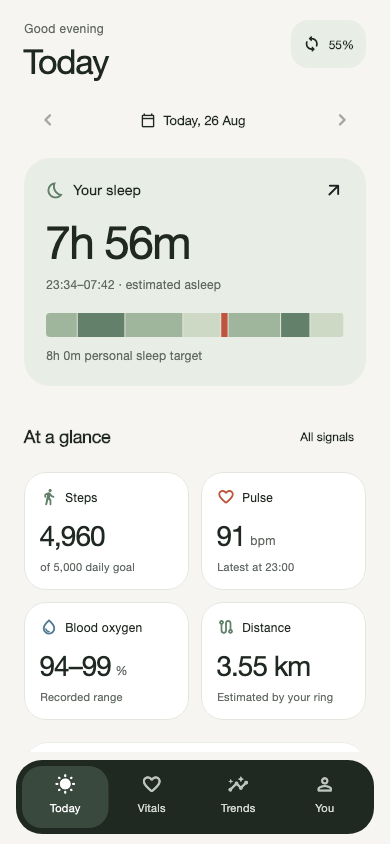
  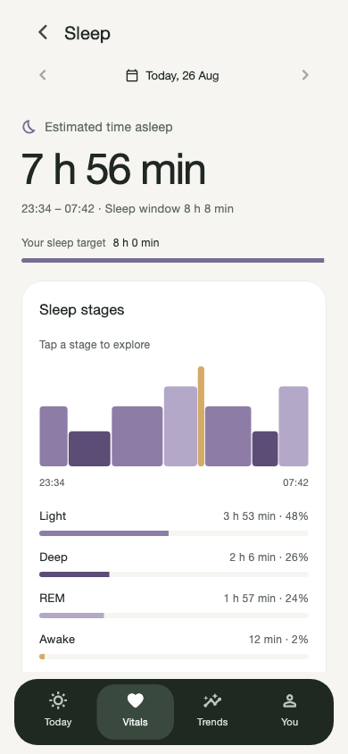
  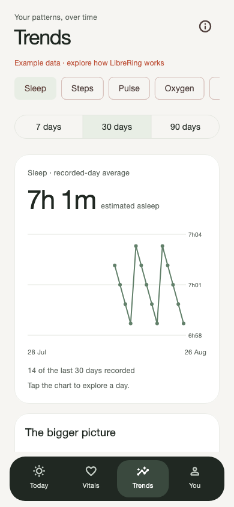
</p>

## Why LibreRing

Affordable smart rings can collect useful signals, but the experience around
them is often cloud-dependent, vague about provenance, or overconfident about
what a sensor can prove. LibreRing takes a narrower path:

- **Local-first:** ring history and manual context stay on the phone.
- **Evidence before interpretation:** measured, firmware-estimated, manual,
  missing, and unsupported data remain visibly different.
- **No account required:** the supported R12 path talks to the ring over BLE.
- **No fake precision:** gaps stay gaps; oxygen remains a min–max range; opaque
  firmware fields are not renamed as clinical metrics.
- **A product, not just a protocol demo:** pairing, daily summaries, drill-downs,
  trends, journal context, privacy controls, export, and deletion are designed
  as one coherent mobile experience.

LibreRing is a development preview, not a medical device. It is not in the App
Store or Play Store yet.

## See it in motion

[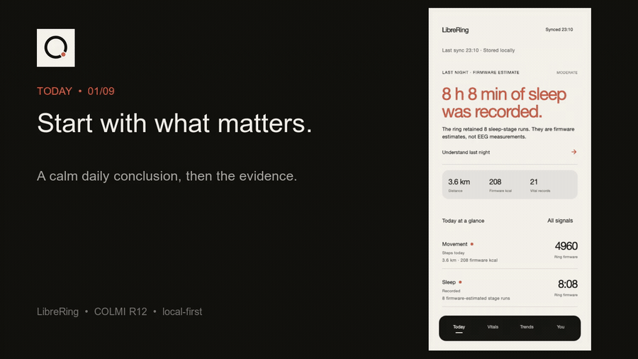](docs/media/librering-tour.mp4)

<p align="center"><sub>Earlier preview: 11.6-second tour of the previous layout · click for MP4 · deterministic fictional data. Current refinement screenshots are above and below.</sub></p>

## Refinement preview

Today brings sleep and key readings forward. Vitals keeps the full supported
signal set one tap away. Trends offers inspectable daily points and 7/30/90-day
comparisons with missing days left empty. Root tabs preserve your place, and
detail screens use native navigation and accessible chart controls.

Name, distance units, and personal step/sleep goals now persist locally. Saves
and deletion report failures without discarding your records, and sync remains
bounded to the verified R12 path. See the [refinement QA record](docs/testing/refinement-2026-09-05.md)
for scope and outstanding hardware verification.

## What the R12 can supply

The current production path is deliberately gated to one physically inspected
COLMI R12 running firmware `RT11CR_1.00.09_260424`. Protocol correctness is
tested; physiological accuracy is not independently validated.

| Signal or capability | Current status | What LibreRing says |
| --- | --- | --- |
| Local BLE pairing and device facts | Supported | Exact-family discovery, service validation, battery, and firmware |
| Activity history | Supported | Steps plus clearly labelled firmware distance and calorie estimates |
| Pulse history | Supported | Recorded BPM-like samples with gaps preserved; not a diagnosis |
| Sleep history | Supported | Firmware session and stage-duration estimates; not EEG |
| Blood oxygen history | Supported | Hourly firmware minimum–maximum ranges; not medical oximetry |
| Firmware “HRV” field | Exploratory | Shown only as an opaque firmware index, never RMSSD or SDNN |
| Firmware stress field | Exploratory | Shown only as an opaque vendor index, never emotional or clinical stress |
| Live pulse / oxygen | Transport verified | The owned-device run produced warm-up packets but no non-zero reading, so the UI reports no reading |
| Temperature, blood pressure, respiration, VO₂ max | Unsupported | Not shown as measured R12 data |
| Recovery / readiness score | Not enabled from R12 data | LibreRing does not manufacture a score from unsupported inputs |

See the [R12 evidence record](docs/protocol/colmi-r12-evidence.md) and
[protocol matrix](docs/protocol/colmi-qring.md) for commands, confidence levels,
fixtures, and remaining physical-device work.

## Screen gallery

These are representative deterministic 390 × 844 renders from the app's widget tests. The
first group is the R12-backed product path. Screens marked **concept/demo** test
UX states and do not claim that the ring supplies a score or unsupported metric.

<table>
  <tr>
    <td align="center"><br /><sub>Today · R12-backed</sub></td>
    <td align="center">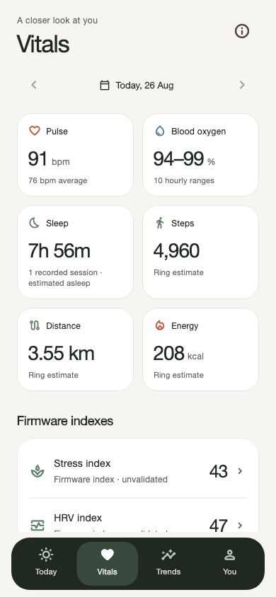<br /><sub>Vitals · R12-backed</sub></td>
    <td align="center">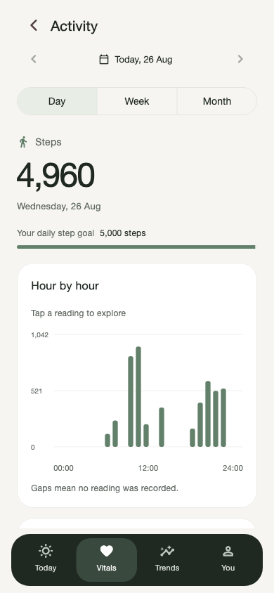<br /><sub>Activity · R12-backed</sub></td>
    <td align="center">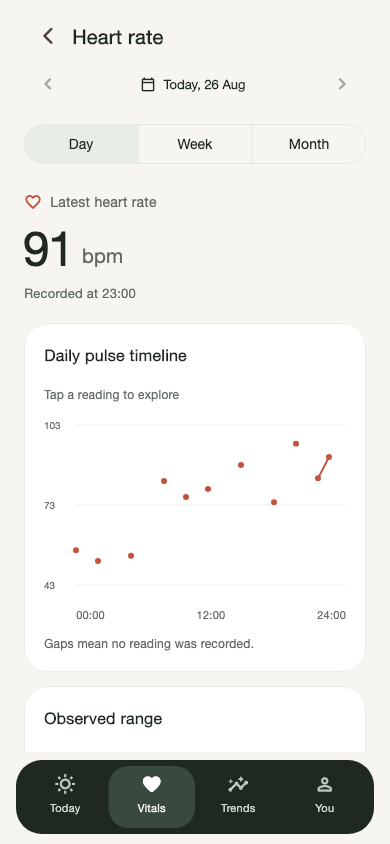<br /><sub>Heart · R12-backed</sub></td>
  </tr>
  <tr>
    <td align="center"><br /><sub>Sleep · firmware estimate</sub></td>
    <td align="center">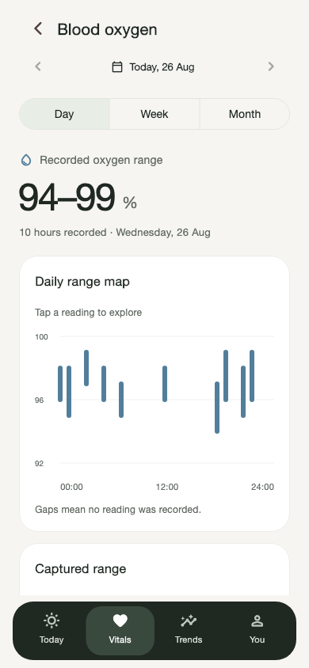<br /><sub>Oxygen · firmware ranges</sub></td>
    <td align="center">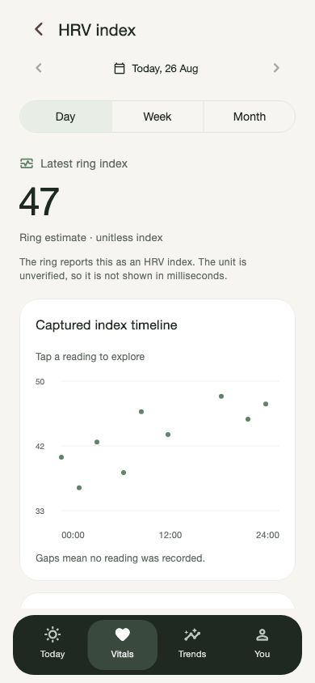<br /><sub>Firmware HRV index</sub></td>
    <td align="center">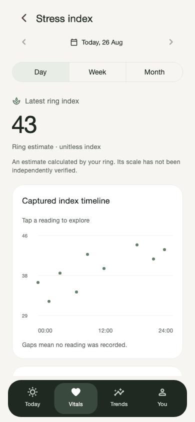<br /><sub>Firmware stress index</sub></td>
  </tr>
  <tr>
    <td align="center">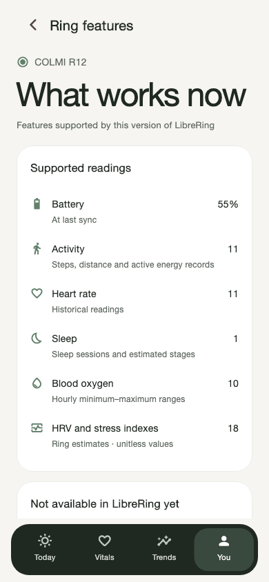<br /><sub>Ring capabilities</sub></td>
    <td align="center"><br /><sub>Trends</sub></td>
    <td align="center">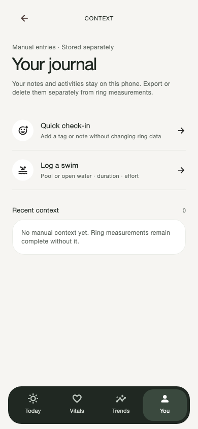<br /><sub>Journal</sub></td>
    <td align="center">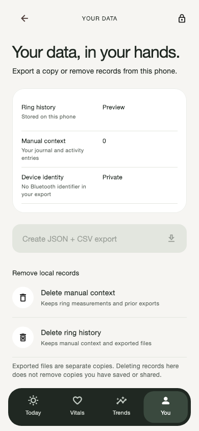<br /><sub>Data and deletion</sub></td>
  </tr>
  <tr>
    <td align="center">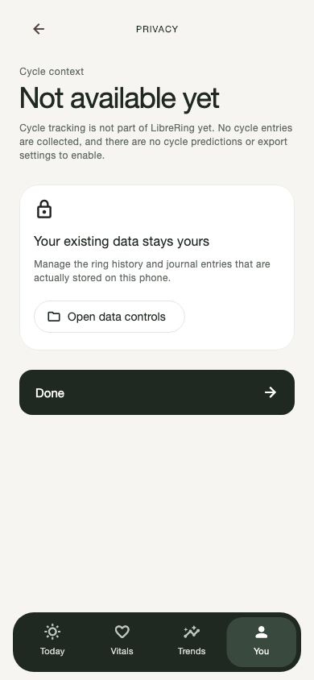<br /><sub>Cycle privacy</sub></td>
    <td align="center">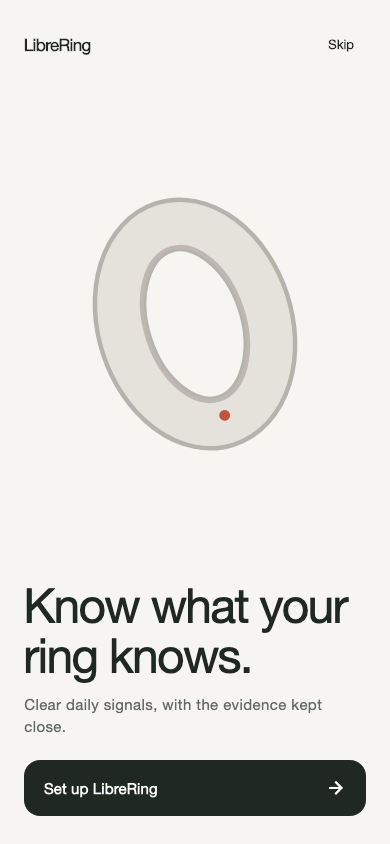<br /><sub>Welcome</sub></td>
    <td align="center">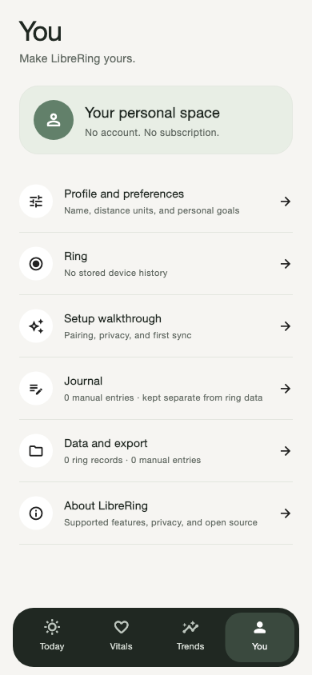<br /><sub>You</sub></td>
    <td align="center">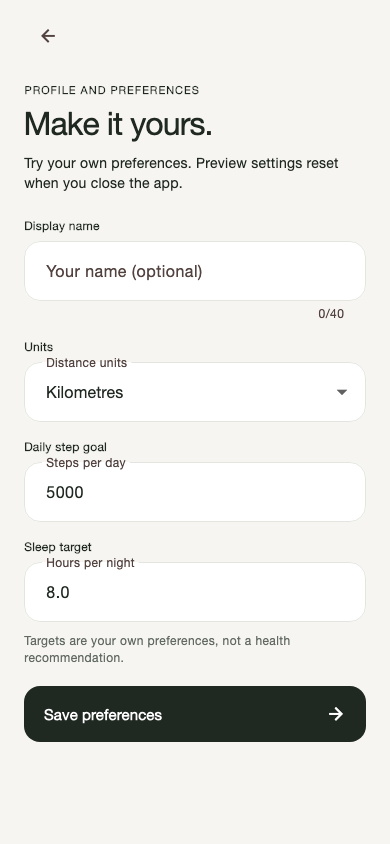<br /><sub>Profile and personal goals</sub></td>
  </tr>
  <tr>
    <td align="center">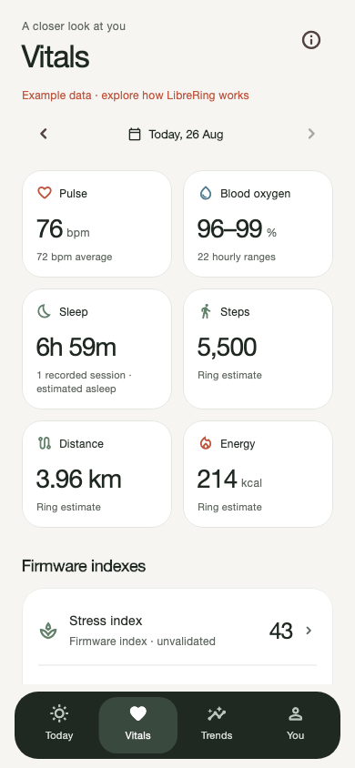<br /><sub>Vitals overview · concept/demo</sub></td>
    <td align="center">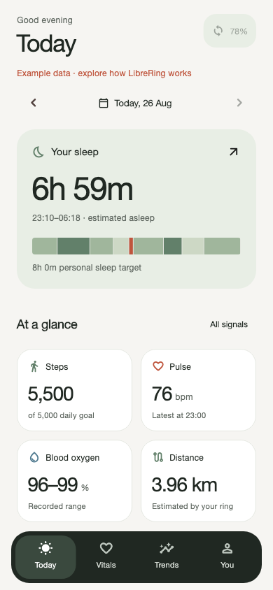<br /><sub>Daily conclusion · concept/demo</sub></td>
    <td align="center">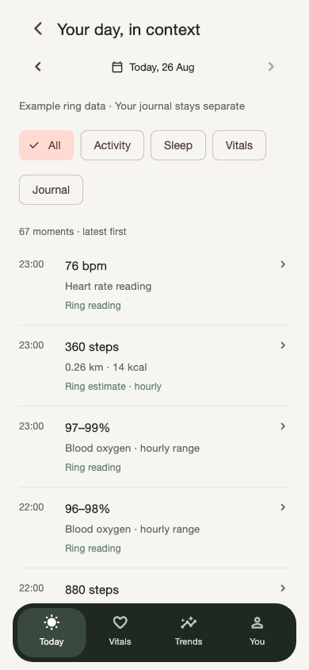<br /><sub>Timeline · concept/demo</sub></td>
    <td align="center">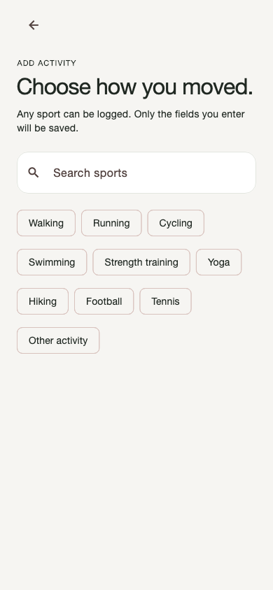<br /><sub>Activity picker · concept/demo</sub></td>
  </tr>
  <tr>
    <td align="center">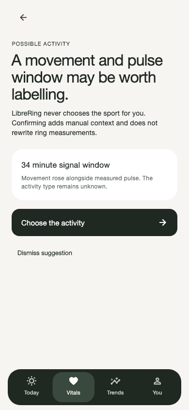<br /><sub>Activity suggestion · concept/demo</sub></td>
    <td align="center">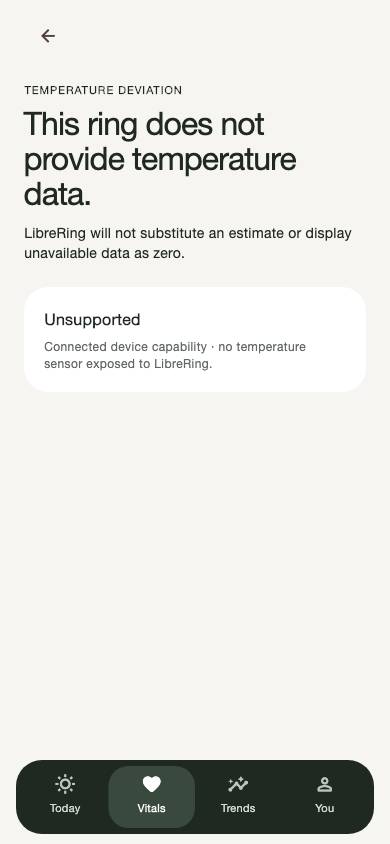<br /><sub>Unsupported temperature</sub></td>
    <td></td>
    <td></td>
  </tr>
</table>

## Architecture

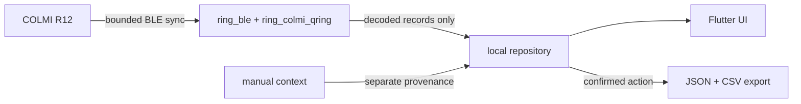

- Raw BLE captures and stable device identifiers cannot enter the repository API.
- Sync is duplicate-safe, bounded, and fail-closed for unknown firmware.
- Manual entries remain separate from ring measurements.
- Export is an explicit user action and includes a SHA-256 manifest; sharing uses the native share sheet.

## Quick start

Requirements: Flutter `3.47.x`, Dart `3.13.x`, Xcode for iOS, or Android
Studio/SDK for Android.

```sh
git clone https://github.com/rubarksfield/librering.git
cd librering/apps/mobile
flutter pub get
flutter run --dart-define=LIBRERING_DEMO=true
```

The demo boundary uses fictional data and needs no ring. Omit the define for the
production pairing and local-sync path. Production never substitutes demo
values when stored ring data is unavailable.

For an iPhone app that launches from the Home Screen, build profile or release
mode through Flutter/Xcode; iOS intentionally restricts standalone launch of
debug Flutter builds.

```sh
flutter build ios --release
```

## Verify the project

```sh
cd apps/mobile
flutter analyze
flutter test

cd ../../research/scoring
python3 run_research.py
python3 -m unittest discover tests -v
```

The Flutter suite includes route, persistence, export/deletion, BLE adapter,
decoder, compact-screen, accessibility, and golden-render coverage. The scoring
sandbox uses a fixed seed and fictional data; passing it does not establish
clinical validity.

## Project map

| Path | Purpose |
| --- | --- |
| [`apps/mobile`](apps/mobile) | Flutter app for iOS and Android |
| [`packages/ring_ble`](packages/ring_ble) | Transport-independent BLE and sync contracts |
| [`packages/ring_colmi_qring`](packages/ring_colmi_qring) | Fail-closed COLMI/QRing packet decoding |
| [`packages/ring_core`](packages/ring_core) | Health-domain records and provenance |
| [`packages/ring_design_system`](packages/ring_design_system) | LibreRing tokens and reusable UI components |
| [`docs/protocol`](docs/protocol) | R12 evidence, command matrix, and fixture policy |
| [`research/scoring`](research/scoring) | Independent, synthetic scoring research—not production scoring |

## Looking for an open smart-ring app?

People often discover this space while searching for an Oura Ring alternative,
RingConn app, Ultrahuman Ring AIR dashboard, Samsung Galaxy Ring companion,
WHOOP alternative, Garmin/Fitbit wearable dashboard, or an open-source
COLMI/QRing app. LibreRing currently connects only to the verified COLMI R12
path described above. It does **not** connect to Oura, RingConn, Ultrahuman,
Samsung, WHOOP, Garmin, Fitbit, or Apple Ring devices.

LibreRing is independent and is not affiliated with, authorised by, sponsored
by, or endorsed by COLMI, QRing, Oura, RingConn, Ultrahuman, Samsung, WHOOP,
Garmin, Fitbit, Apple, or their owners. All marks belong to their respective
owners and are used only to describe interoperability and product-category
context.

## Contribute

The project is ready for careful contributors—especially Flutter engineers,
BLE/protocol researchers with owned hardware, accessibility testers, Android
device testers, privacy reviewers, and designers who value clarity over fake
certainty.

Start with the [contribution guide](CONTRIBUTING.md), the
[roadmap](docs/ROADMAP.md), or an issue labelled
[`good first issue`](https://github.com/rubarksfield/librering/labels/good%20first%20issue).
Never post personal health data, stable device identifiers, or raw captures in a
public issue.

## Licence and safety

Original LibreRing code and assets are licensed under
[Apache-2.0](LICENSE). Reference projects informed protocol facts and design
research only; see [third-party notices](THIRD_PARTY_NOTICES.md).

LibreRing is experimental wellness software, not a medical device. Do not use
it to diagnose, treat, or make urgent health decisions.
