<p align="center">
  
</p>

<h1 align="center">LibreRing</h1>

<p align="center"><strong>Your ring. Your data. Kept close.</strong></p>

<p align="center">
  A local-first, open-source Flutter companion for the COLMI R12 smart ring.<br />
  Clear daily readings. Thoughtful details. No account or subscription in the current app.
</p>

<p align="center">
  <a href="https://github.com/rubarksfield/librering/actions/workflows/ci.yml"></a>
  
  
  
  <a href="LICENSE"></a>
</p>

<p align="center">
  <a href="https://github.com/rubarksfield/librering/releases/tag/v1.3.2">Release 1.3.2</a> ·
  <a href="#quick-start">Quick start</a> ·
  <a href="#what-the-r12-can-supply">Supported data</a> ·
  <a href="#screen-gallery">Screens</a> ·
  <a href="CHANGELOG.md">Changelog</a> ·
  <a href="CONTRIBUTING.md">Contribute</a>
</p>

<p align="center">
  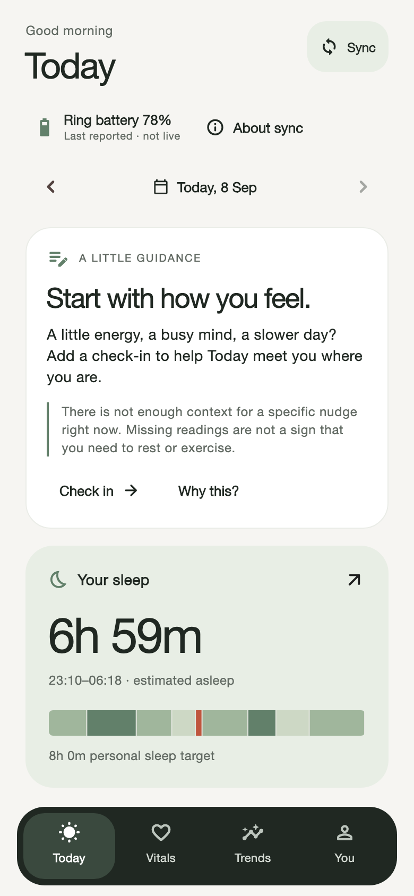
  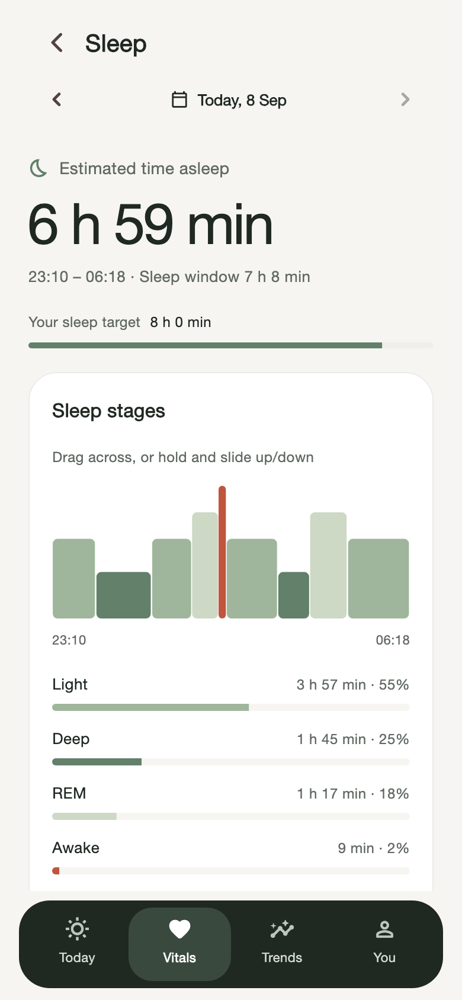
  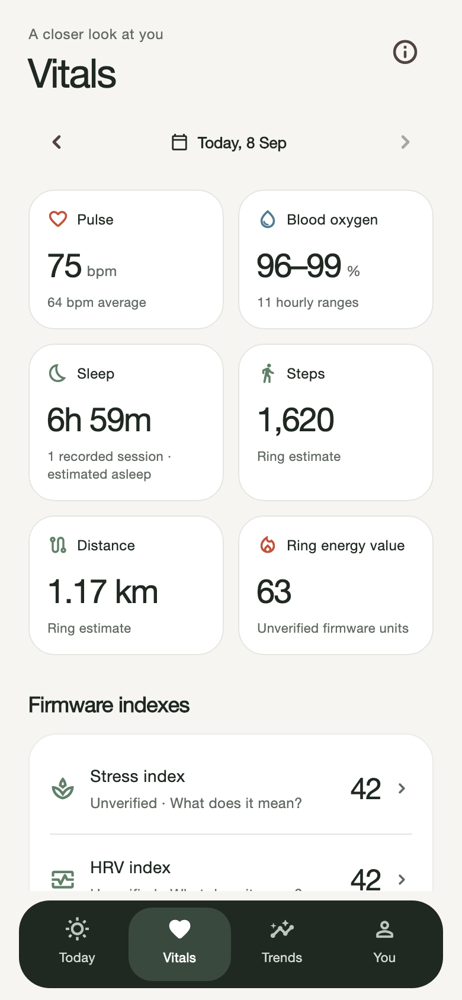
</p>

<p align="center"><sub>Actual Flutter screens with deterministic fictional test data—not personal health records or evidence of sensor accuracy.</sub></p>

## A calmer way to understand your ring

LibreRing brings sleep, movement, pulse and oxygen history into a warm,
sage-green interface you can explore at your own pace. Inspect a night, compare
recorded days, add your own context, and understand what each number can—and
cannot—tell you.

- **Your data stays close.** Ring history, journal entries and preferences are
  stored on your phone. Export and sharing are explicit choices.
- **Clarity next to the number.** HRV, stress, energy, battery and sync have
  explanations in the app, not just in a manual.
- **Details that feel considered.** Inspectable charts, green sleep stages,
  restrained native haptics, persistent tab position and reduced-motion support.
- **Honest when data is missing.** Gaps stay gaps. Firmware estimates are labelled.
  Unsupported measurements do not become made-up health scores.
- **No account to create.** The supported COLMI R12 path connects over Bluetooth.
  The current app has no billing or paid tier; it also has no LibreRing cloud
  account, cloud backup or cross-phone sync.

**Status: development preview / source release.** Version **1.3.2 (13)** has
been built, installed and launched on an owned iPhone using development signing.
This is not App Store, Play Store or TestFlight distribution; there is no public
IPA to install. See the [release record](docs/testing/release-1.3.2.md) for what
was checked and what still needs hardware testing.

## See it in motion

<p align="center">
  <a href="docs/media/v1.3.2/librering-tour.mp4">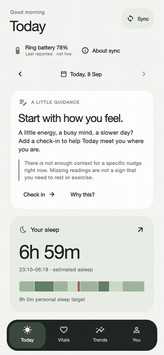</a>
</p>

<p align="center"><sub>26-second screenshot tour · fictional fixtures on the production UI path · click for MP4. Sync progress is simulated; this is not a physical-ring or live-measurement recording. <a href="docs/media/v1.3.2/README.md">Media provenance</a></sub></p>

## What's new in 1.3.2

- **Pull to refresh the saved view.** Today, Vitals, Trends and reading details
  reload local phone data, even on short or empty pages. Existing readings stay
  visible if a reload fails. **Sync** remains the separate Bluetooth action that
  fetches ring history.
- **Newly saved readings appear immediately.** A reproduced clock-cache delay
  is fixed; a successful sync updates Today and previously visited Vitals without
  another pull. This is a specific display fix, not a claim that every possible
  missing-ring-data issue is solved.
- **A more tactile interface.** Navigation, chart selections and actual
  save/refresh outcomes have restrained haptics. Disabled controls and passive
  updates stay quiet; sleep feedback follows stage boundaries.
- **Inspection stays trustworthy.** Historical dates remain selected after
  refresh. Changed chart samples cannot leave an old value selected, and Trends
  keeps the chosen calendar day across midnight.
- **Live means live.** The pulse page explains saved readings versus on-demand
  acquisition. Live pulse and oxygen remain unavailable in production until
  usable physical readings and safe stop/cancel behaviour are verified.

The release builds on green sleep scrubbing, staged sync feedback, a separate
last-reported ring-battery label, safe introduction replay, and daily suggestions
with a visible **Why this?** explanation. HRV and stress firmware indexes never
drive those suggestions.

[Full changelog](CHANGELOG.md) · [Refresh and haptics QA](docs/testing/refresh-haptics-2026-09-07.md) · [In-app explanation guide](docs/testing/in-app-explanations-2026-09-05.md)

## What the R12 can supply

The current production path is deliberately gated to one physically inspected
COLMI R12 running firmware `RT11CR_1.00.09_260424`. Protocol correctness is
tested; physiological accuracy is not independently validated.

| Signal or capability | Current status | What LibreRing says |
| --- | --- | --- |
| Local BLE pairing and device facts | Supported | Exact-family discovery, service validation, battery, and firmware |
| Activity history | Supported | Steps and firmware-estimated distance; “Ring energy value” has unverified units and is **not** presented as confirmed active calories |
| Pulse history | Supported | Recorded BPM-like samples with gaps preserved; not a diagnosis |
| Sleep history | Supported | Firmware session and stage-duration estimates; not EEG |
| Blood oxygen history | Supported | Hourly firmware minimum–maximum ranges; not medical oximetry |
| Firmware “HRV” field | Exploratory | Shown only as an opaque firmware index, never RMSSD or SDNN |
| Firmware stress field | Exploratory | Shown only as an opaque vendor index, never emotional or clinical stress |
| Live pulse / oxygen | Not enabled in production | Owned-device tests returned warm-up packets, not usable readings; a Bluetooth connection is not live measurement |
| Temperature, blood pressure, respiration, VO₂ max, ring GPS | Unsupported | Not shown as measured R12 data |
| Recovery / readiness score | Not enabled from R12 data | LibreRing does not manufacture a score from unsupported inputs |

See the [R12 evidence record](docs/protocol/colmi-r12-evidence.md) and
[protocol matrix](docs/protocol/colmi-qring.md) for commands, confidence levels,
fixtures, and remaining physical-device work. The [live-measurement acceptance
checklist](docs/testing/live-pulse-acceptance-2026-09-07.md) explains why live
pulse and oxygen are still gated.

## Screen gallery

These versioned captures render the current Flutter production UI with
deterministic fictional fixtures. They show the interface and its data boundaries,
not private readings, concept screens or proof of physiological accuracy.

<table>
  <tr>
    <td align="center">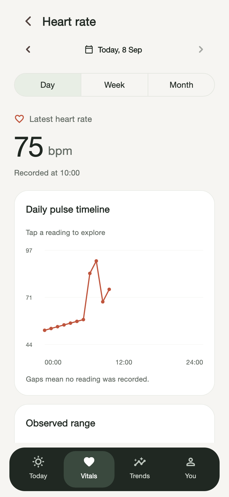<br /><sub>Pulse · saved readings</sub></td>
    <td align="center">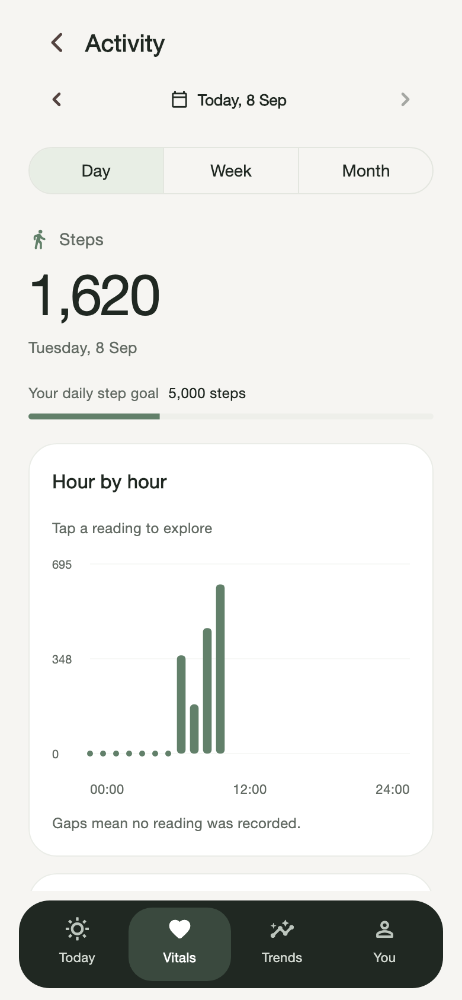<br /><sub>Activity · honest energy units</sub></td>
    <td align="center">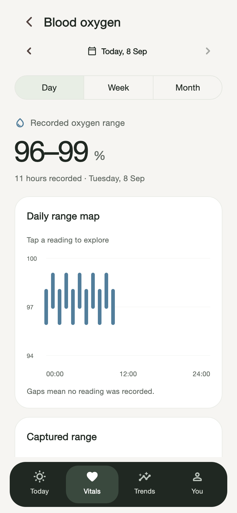<br /><sub>Oxygen · firmware ranges</sub></td>
  </tr>
  <tr>
    <td align="center">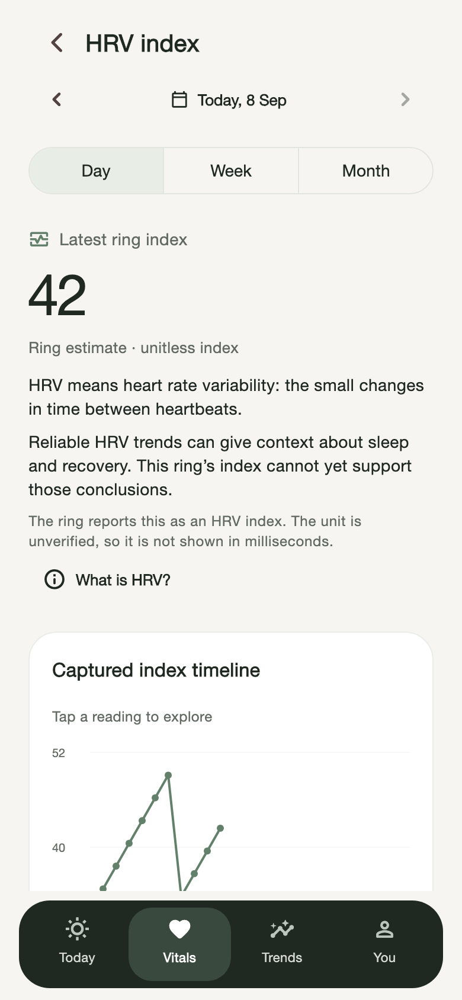<br /><sub>HRV index · limits made visible</sub></td>
    <td align="center">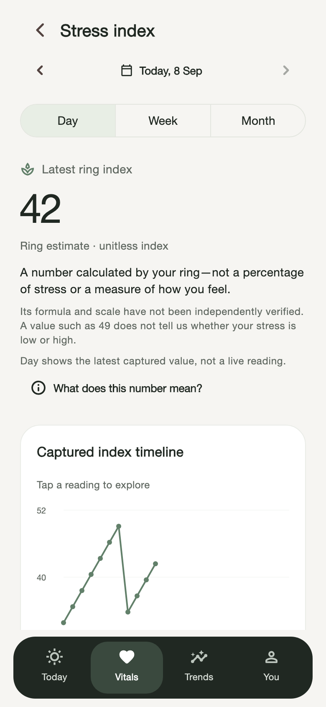<br /><sub>Stress index · not a diagnosis</sub></td>
    <td align="center">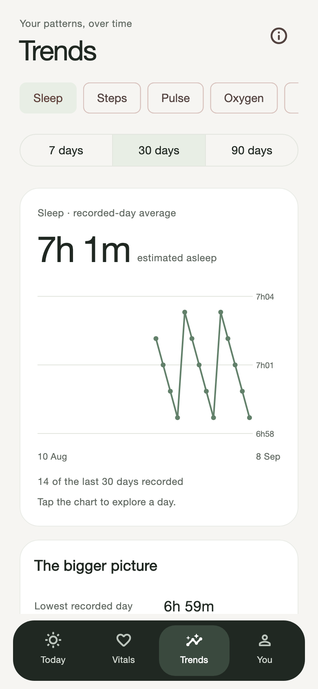<br /><sub>Trends · explore recorded days</sub></td>
  </tr>
  <tr>
    <td align="center">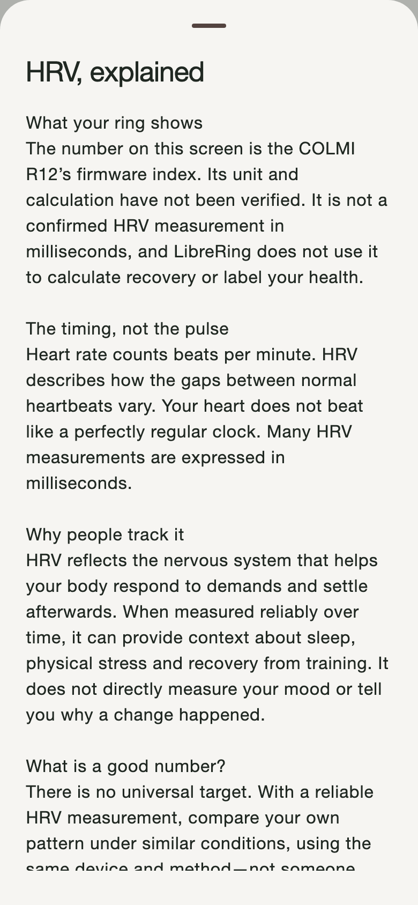<br /><sub>What is HRV?</sub></td>
    <td align="center">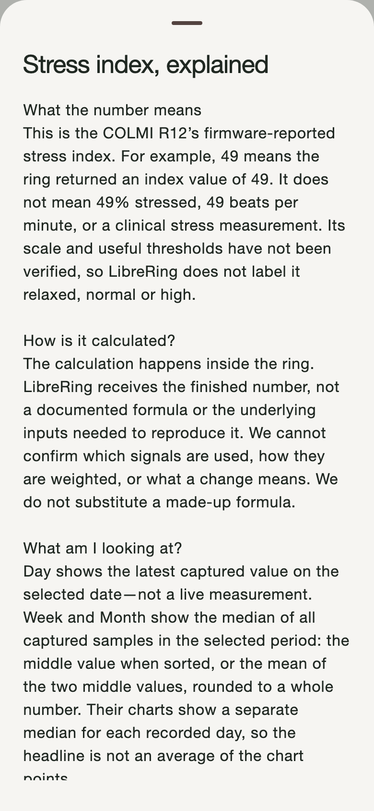<br /><sub>What does stress mean?</sub></td>
    <td align="center">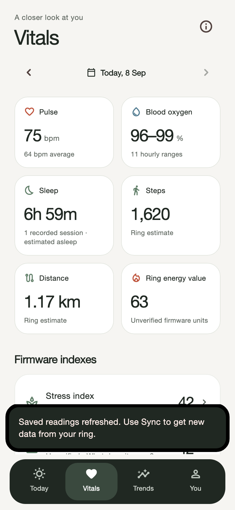<br /><sub>Refresh · saved phone data</sub></td>
  </tr>
  <tr>
    <td align="center">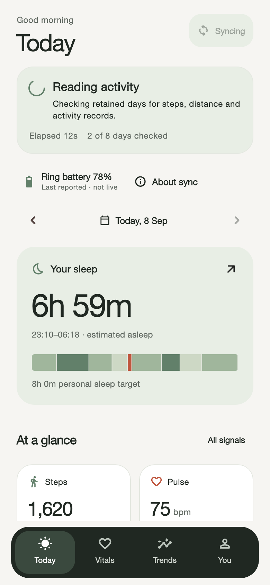<br /><sub>Sync · simulated progress state</sub></td>
    <td align="center">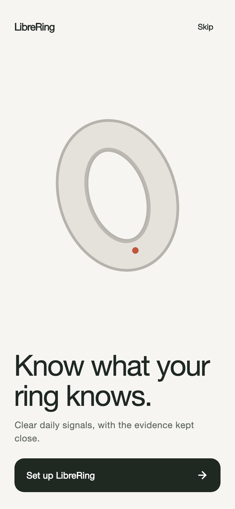<br /><sub>Welcome · revisit any time</sub></td>
    <td align="center"><a href="docs/media/v1.3.2/librering-tour.mp4">Watch the screen tour</a><br /><sub>Current version · fictional fixtures</sub></td>
  </tr>
</table>

## Architecture

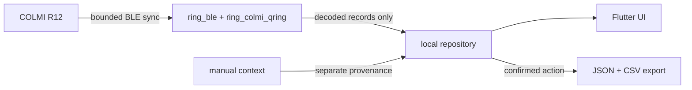

- Raw BLE captures and stable device identifiers cannot enter the repository API.
- Sync is duplicate-safe, bounded, and fail-closed for unknown firmware.
- Manual entries remain separate from ring measurements.
- Export is an explicit user action and includes a SHA-256 manifest; sharing uses the native share sheet.

## Quick start

Requirements: Flutter `3.47.x`, Dart `3.13.x`, Xcode for iOS, or Android
Studio/SDK for Android.

```sh
git clone https://github.com/rubarksfield/librering.git
cd librering/apps/mobile
flutter pub get
flutter run --dart-define=LIBRERING_DEMO=true
```

The demo boundary uses fictional data and needs no ring. Omit the define for the
production pairing and local-sync path. Production never substitutes demo
values when stored ring data is unavailable.

For an iPhone app that launches from the Home Screen, build profile or release
mode through Flutter/Xcode; iOS intentionally restricts standalone launch of
debug Flutter builds. A physical iPhone build requires your own Xcode signing
configuration. Source code is not a pre-signed distributable app.

```sh
flutter run --release --dart-define=LIBRERING_DEMO=false --dart-define=LIBRERING_CAPTURE=false
```

## Verify the project

```sh
cd apps/mobile
flutter analyze
flutter test

cd ../../research/scoring
python3 run_research.py
python3 -m unittest discover tests -v
```

The 1.3.2 mobile release preflight passed **427 tests** and a clean analyzer.
Coverage includes real pull gestures, automatic post-sync updates, storage
failures, chart selection, haptic events, accessibility and golden renders.
Package-level protocol tests are separate; see the [QA record](docs/testing/refresh-haptics-2026-09-07.md)
for exact commands and results. The scoring sandbox uses fictional data and is
not production scoring or clinical validation.

An installed release is not proof of every hardware interaction. Real-ring sync
regression, tactile feel, full physical-device VoiceOver and live-sensor
acceptance remain separate checks.

## Project map

| Path | Purpose |
| --- | --- |
| [`apps/mobile`](apps/mobile) | Flutter app for iOS and Android |
| [`packages/ring_ble`](packages/ring_ble) | Transport-independent BLE and sync contracts |
| [`packages/ring_colmi_qring`](packages/ring_colmi_qring) | Fail-closed COLMI/QRing packet decoding |
| [`packages/ring_core`](packages/ring_core) | Health-domain records and provenance |
| [`packages/ring_design_system`](packages/ring_design_system) | LibreRing tokens and reusable UI components |
| [`docs/protocol`](docs/protocol) | R12 evidence, command matrix, and fixture policy |
| [`research/scoring`](research/scoring) | Independent, synthetic scoring research—not production scoring |

## Looking for an open smart-ring app?

Looking for an Oura Ring alternative, a RingConn or Ultrahuman Ring AIR
dashboard, or an open-source COLMI / QRing app—even if your search was
“Colomi ring”? The compatibility boundary matters: LibreRing currently connects
only to the verified **COLMI R12** path described above. It does **not** connect
to Oura, RingConn, Ultrahuman, Samsung Galaxy Ring, WHOOP, Garmin or Fitbit
devices.

LibreRing is independent and is not affiliated with, authorised by, sponsored
by, or endorsed by COLMI, QRing, Oura, RingConn, Ultrahuman, Samsung, WHOOP,
Garmin, Fitbit, Apple, or their owners. All marks belong to their respective
owners and are used only to describe interoperability and product-category
context.

## Contribute

The project is ready for careful contributors—especially Flutter engineers,
BLE/protocol researchers with owned hardware, accessibility testers, Android
device testers, privacy reviewers, and designers who value clarity over fake
certainty.

Start with the [contribution guide](CONTRIBUTING.md), the
[roadmap](docs/ROADMAP.md), or an issue labelled
[`good first issue`](https://github.com/rubarksfield/librering/labels/good%20first%20issue).
Never post personal health data, stable device identifiers, or raw captures in a
public issue.

## Licence and safety

Original LibreRing code and assets are licensed under
[Apache-2.0](LICENSE). Reference projects informed protocol facts and design
research only; see [third-party notices](THIRD_PARTY_NOTICES.md).

LibreRing is experimental wellness software, not a medical device. Do not use
it to diagnose, treat, or make urgent health decisions.
